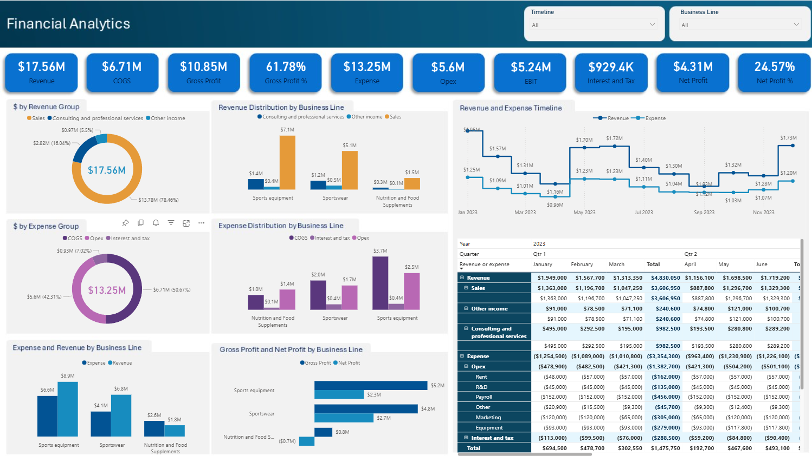
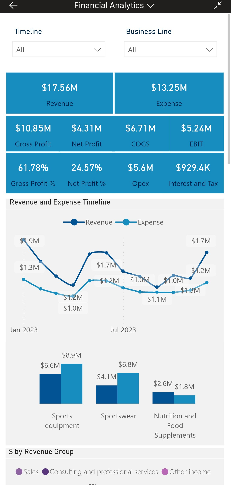
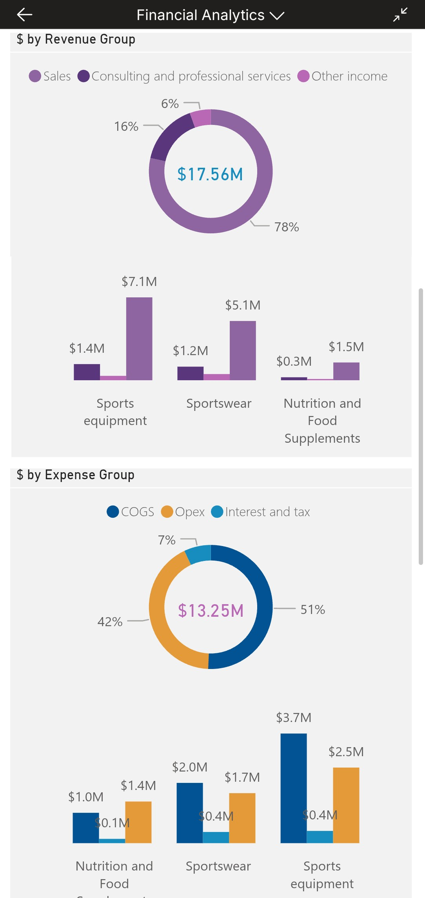

# Financial Performance Dashboard

This project showcases a responsive Power BI dashboard designed to analyze business financials across revenue, expenses, profit margins, and category-level breakdowns. Built with both desktop and mobile views, the dashboard enables stakeholders to monitor performance trends and make informed decisions on the go.

## 🔗 Live Report

Explore the interactive dashboard here:  
[View Financial Dashboard](https://app.powerbi.com/view?r=eyJrIjoiMWIwZjI5ZjktNWI5Yy00MDMyLTkzZWYtYTU2NjUxNDJiMDk3IiwidCI6ImRmODY3OWNkLWE4MGUtNDVkOC05OWFjLWM4M2VkN2ZmOTVhMCJ9)


<p align="center">
  
  
</p>

---

## 📱 Responsive Design

- **Desktop View**: Full layout with KPIs, charts, and detailed breakdowns
- **Mobile View**: Optimized for quick access to key metrics and visual summaries
- **Consistent Styling**: Unified color palette and layout across devices

---

## 🔍 Features

- **Top KPIs**: Revenue, Expense, Gross Profit, Net Profit, COGS, EBIT
- **Timeline Analysis**: Monthly revenue vs expense trends
- **Category Breakdown**: Revenue and expense by product group and business line
- **Profitability Insights**: Gross and net profit distribution across segments
- **Interactive Filters**: Drill-down by category, time period, and business unit

---

## 🛠️ Tech Stack

- Power BI for dashboard development
- DAX for calculated metrics
- GitHub for documentation

---

## 📁 Folder Structure

```
📁 financial_performance_dashboard/

├── assets/
│   └── desktop_view.png
│   └── mobile_view_screenshot_1.png
│   └── mobile_view_screenshot_2.png
├── reports/
│   └── Financial Analytics.pbix
├── README.md
```

---

## 🚀 How to Use

1. Open `Financial Analytics.pbix` in Power BI Desktop
2. Replace or refresh the data source with your financial dataset
3. Customize filters and visuals as needed
4. Publish to Power BI Service for mobile access

---

## 📬 Contact

For feedback or collaboration, reach out via GitHub or LinkedIn.
